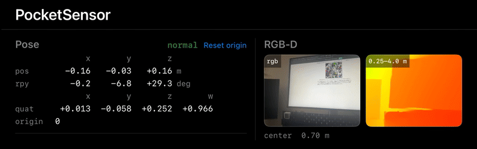

**English** | [日本語](README.ja.md)

# pocketsensor

An iOS app and a Python SDK that use an iPhone as a sensor for a robot or a PC.
They stream LiDAR depth, the camera, pose, IMU, and GNSS over Wi-Fi or USB.
The data uses standard ROS 2 message types, so Lichtblick, rosbag2, and ROS 2 nodes work unchanged.



## Requirements

- An iPhone with LiDAR (iOS 17 or later)
- Xcode and [XcodeGen](https://github.com/yonaskolb/XcodeGen)
- Python 3.10 or later and [uv](https://docs.astral.sh/uv/)
- [mise](https://mise.jdx.dev/) and Docker (used to launch Lichtblick and to check ROS 2)

## Installation

### iOS app

```
cd ios/PocketSensor
echo 'DEVELOPMENT_TEAM = <your Team ID>' > Local.xcconfig
xcodegen generate && open PocketSensor.xcodeproj
```

In Xcode, select a physical device and run the app.

### Python SDK

```
uv add --editable <this repository>/python --extra discovery
```

## Usage

While the app is in the foreground, it listens at `ws://<iPhone name>.local:8765`.
The SDK and the commands can open a device connected over USB with `usb:`.

### Visualization

```
SOURCE=ws://<iPhone name>.local:8765 mise run view:lichtblick
```

Open the URL that is printed. It shows 3D, RGB, and depth side by side.
In a local Lichtblick or Foxglove, choose Foxglove WebSocket as the connection type and open the same address.

### Python

```python
import pocketsensor as ps

config = ps.Config(streams=[ps.Color(), ps.Depth(), ps.Pose(), ps.Imu()])
with ps.open("ws://iphone.local:8765", config) as dev:   # "usb:" and "run.mcap" work the same way
    frames = dev.wait_for_frames()
    depth_m = frames.depth.meters      # float32; invalid values are NaN
    pose = frames.pose                 # REP-103, from odom to link
    imu = dev.imu.read_all()           # every sample since the previous call
```

### CLI

```
pocketsensor discover                          # find devices
pocketsensor info   ws://iphone.local:8765     # device info, calibration, and clock sync
pocketsensor record ws://iphone.local:8765 -o run.mcap
pocketsensor echo   run.mcap /pocketsensor/odom
pocketsensor check-axes   usb:                 # after mounting, check the axis directions
pocketsensor check-anchor usb:                 # check the anchor of a reference image
```

A recorded MCAP also opens in `ros2 bag play` and Lichtblick.
Examples that display the stream with OpenCV and Rerun are in [examples/](examples/README.en.md).

### ROS 2

```
ros2 launch pocketsensor_ros relay.launch.py source:=ws://iphone.local:8765
```

The build and parameters are described in [ros2/pocketsensor_ros/](ros2/pocketsensor_ros/README.en.md).

## Topics

| Data | Topic | Format | Default rate |
| --- | --- | --- | --- |
| Pose (ARKit) | `/<name>/odom`, `/tf` | `nav_msgs/Odometry` | 30 Hz |
| RGB | `/<name>/color/image/compressed` | JPEG, 960×720 | 15 Hz |
| LiDAR depth | `/<name>/depth/image`, `.../compressedDepth` | `16UC1` millimeters, 256×192. Uncompressed and PNG | 15 Hz |
| Depth confidence | `/<name>/depth/confidence`, `.../compressed` | `mono8`. Uncompressed and PNG | 15 Hz |
| IMU | `/<name>/imu/data`, `/<name>/imu/data_raw` | `sensor_msgs/Imu` | 100 Hz |
| Magnetometer | `/<name>/imu/mag` | `sensor_msgs/MagneticField` | 50 Hz |
| Pressure | `/<name>/pressure` | `sensor_msgs/FluidPressure` | about 1 Hz |
| GNSS | `/<name>/gnss/fix` | `sensor_msgs/NavSatFix` | about 1 Hz |
| Battery and diagnostics | `/<name>/battery`, `/diagnostics` | `BatteryState`, `DiagnosticArray` | 1 Hz |
| Reference-image anchor | `/tf` | Position and orientation of a printed marker | 30 Hz |

- Coordinates follow REP-103, units are SI, and timestamps are the times the device measured
- A sensor runs only while it is subscribed
- `<name>` is the device name. The default is `pocketsensor`

## Development

```
mise run test        # Python, Swift, and E2E
mise run test:ios    # app unit tests (simulator)
mise run test:ros2   # checks in a ROS 2 container (Docker)
mise run sim         # a fake device for trying the stack without an iPhone
```

The source of truth for message types and channels is `contract/`.
Swift and Python code is generated from it.

## Documentation

| Topic | Document |
| --- | --- |
| Connection, channels, settings, and services | [docs/en/protocol.md](docs/en/protocol.md) |
| Coordinate frames and units | [docs/en/frames-and-units.md](docs/en/frames-and-units.md) |
| Timestamps and clock synchronization | [docs/en/time.md](docs/en/time.md) |
| SDK API | [docs/en/sdk-api.md](docs/en/sdk-api.md) |

## License

[Apache-2.0](LICENSE) © bigdra50
